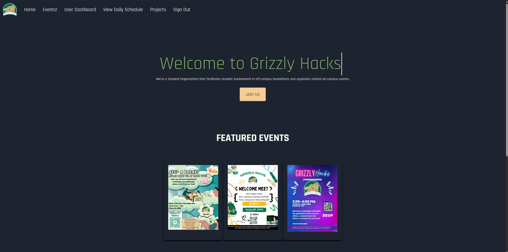
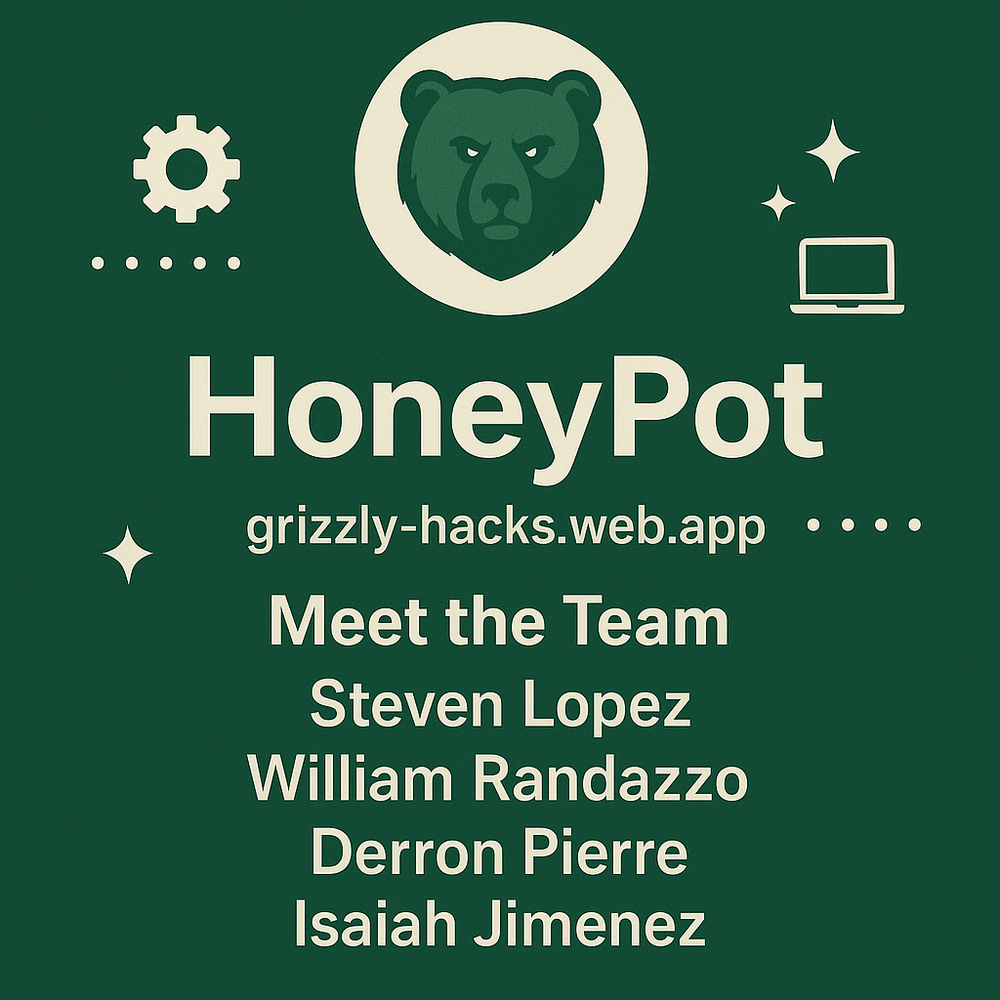

# Grizzly Hacks

<br></br>

## Description

The Grizzly Hacks client, which is a RSO of people who are interested in Hackathons, has tasked the team to work on their previous website, update it with modern features, and to add new components that will allow the clients and future users to access a website that will easily portray news, host events, and provide information about previous Hackathons. The website should have different authentication levels that allow admins to easily edit and add new information onto the website, while users to gain access to features so they can join feature Hackathons and post submissions for current events.

### Updates Spring 2025
This semester, my team and I worked on improving the Grizzly Hacks website. We met regularly with the Grizzly Hacks officers, Dr. Anca, and Dr. Gunay to get feedback and make updates. Most of our work focused on cleaning up the pages, making the UI more user-friendly, and adding new features—like a timeline page to help users keep track of important dates. It’s been a great learning experience and a solid chance to apply what we’ve been learning in class to something real.

<br></br>

## Links

- [Deployed Project](https://grizzly-hacks.web.app/home)
- [Project Documentation](https://github.com/GGC-SD/GrizzlyHacks/tree/master/Documentation)

<br></br>

## Technologies

- Node.js
- Angular
- Bootstrap
- HTML/CSS
- Firebase
- TypeScript

<br></br>

## Working Features

- Real-time Application
- Social Media Links
- Registration System
- Event and Blog Post System
- Sponsors Section
- FAQs
- Mobile Device Friendly

<br></br>


# 🚀 Beginner Guide to Installing NVM and Cloning a Git Project
### 🔄 Added: Spring 2025


## 🧠 What is NVM?

**NVM** stands for **Node Version Manager**. It lets you easily install and switch between different versions of **Node.js**, which is needed to run many JavaScript-based projects.

---

## 🛠️ Step 1: Install NVM

### ✅ For **MacOS** or **Linux**:

1. **Open your terminal** (Press `Cmd + Space`, type “Terminal”, and hit Enter).
2. Run this command to install NVM:
   ```bash
   curl -o- https://raw.githubusercontent.com/nvm-sh/nvm/v0.39.7/install.sh | bash
   ```
3. Once the script finishes, **restart the terminal**, or run:
   ```bash
   source ~/.bashrc   # or ~/.zshrc if you're using zsh
   ```

4. Check if NVM installed correctly:
   ```bash
   nvm --version
   ```

---

### ✅ For **Windows**:

1. Go to the [nvm-windows GitHub page](https://github.com/coreybutler/nvm-windows/releases).
2. Download the **nvm-setup.exe** file under the latest release.
3. Run the installer:
   - Choose where to install NVM and Node.js.
   - Accept default settings if unsure.

4. Once installed, **open Command Prompt** and type:
   ```bash
   nvm version
   ```

---

## 📦 Step 2: Use NVM to Install Node.js

Now that you have NVM:

1. Install the latest LTS (Long-Term Support) version of Node.js:
   ```bash
   nvm install --lts
   ```

2. Use it:
   ```bash
   nvm use --lts
   ```

3. Confirm Node.js and npm are working:
   ```bash
   node -v
   npm -v
   ```

---

## 🌐 Step 3: Install Git (if not installed)

Check if Git is installed:
```bash
git --version
```

If it’s **not installed**, download and install it from:
👉 [https://git-scm.com/downloads](https://git-scm.com/downloads)

After installing, reopen your terminal and try:
```bash
git --version
```

---

## 📁 Step 4: Clone a Git Project

1. Go to the GitHub page of the project.
2. Click the green **Code** button and copy the HTTPS URL.
3. In your terminal, run:
   ```bash
   git clone https://github.com/username/project-name.git
   ```
   Replace the URL with the one you copied.

---

## 📂 Step 5: Enter the Project Folder

```bash
cd project-name
```

Then install dependencies (if it's a Node.js project):
```bash
npm install
```

---

## ✅ You're Done!

You now have:
- NVM installed
- Node.js ready to use
- Git set up
- A project cloned and ready to run

---


## 🚀 Project Installation Steps / How to Run

### 🔄 Updated: Spring 2025

Follow the steps below to set up and run the Grizzly Hacks project locally.

---

### 1️⃣ Clone the Repository

```bash
git clone https://github.com/GGC-SD/GrizzlyHacks
```

---

### 2️⃣ Navigate to the Project Directory

```bash
cd GrizzlyHacks/GGCHacks
```

---

### 3️⃣ Install Project Dependencies

```bash
npm install
```

---

### 4️⃣ Install Angular CLI Globally

```bash
npm install -g @angular/cli
```

---

### 5️⃣ Generate the Environments Directory & File

```bash
ng generate environments
```

---

### 6️⃣ Add Firebase Configuration

Open the newly generated `environment.ts` file and update the `firebase` section with your Firebase credentials:

```ts
export const environment = {
  production: false,
  firebase: {
    apiKey: 'YOUR_API_KEY',
    authDomain: 'YOUR_AUTH_DOMAIN',
    projectId: 'YOUR_PROJECT_ID',
    storageBucket: 'YOUR_STORAGE_BUCKET',
    messagingSenderId: 'YOUR_SENDER_ID',
    appId: 'YOUR_APP_ID',
  }
};
```

> 🔐 **Important:** Never commit your actual Firebase keys to public repositories.

---

### 7️⃣ Start the Development Server

```bash
ng serve
```

> ⏳ The first run may take a few minutes, especially on slower systems. Be patient — it’s setting everything up for you.

---

### 🖥️ View the App in Your Browser

Once the server starts, open your browser and go to:

```
http://localhost:4200
```

> ✅ You should see the homepage of the site. Only admin users will see the Admin Dashboard section.

---

### 📸 Screenshot Preview 

> 

---

<br></br>

## HoneyPot - Spring 2025

- **William Randazzo**

  - _UI/UX_
  - Client Liaison

- **Steven Lopez**

  - Code Architecture/Lead Programmer
  - Project Manager

- **Derron Pierre**
  - _Data modeler_
  - _Documentation Lead_

## Website Wizards - Fall 2024

- **Kenny Amador** :construction_worker:

  - Data modeler
  - Client Liaison

- **_Destiny Lowe_** :paintbrush:

  - _UI/UX Specialist_
  - _Documentation Lead_

- **Jimmy Phan** :computer:

  - _Lead Programmer/Code Architecture_
  - _Testing Lead_

- **Daniel Santoyo** :computer:
  - _Project Manager_
  - _Programmer/Code Architecture_

## Original Contributors

- **Josh Beers** :crown:
  - Lead Programmer
  - Project Manager
- **Danielle Battle** :art:
  - UX/UI
  - Document Lead
- **Anne Joseph** :bar_chart:
  - Data Modeler
  - Testing Lead

<br></br>

## Project Flyer and Video

**OUTDATED** All the features are demonstrated in this [video](https://www.youtube.com/watch?v=1dRrcsm5qKo).<br /><br />
**OUTDATED Website Demo as of Nov 21/2024**
link to the [video](https://www.youtube.com/watch?v=DUOhE-9DSAE)

**UPDATED** - Latest vlog as on Spring 2025, link to the [video](https://youtu.be/PQhXv2pKJ5I)



You can also view our website by clicking on this [link](https://grizzly-hacks.web.app).

<br></br>

## Repo Link

[Repo Link](https://github.com/GGC-SD/GrizzlyHacks)

## Working features added by HoneyPot Spring 2025
1. Timeline/Scheduler
Admins can now create, edit, and delete Hackathon event entries on a timeline to keep attendees informed of the day’s schedule.

2. Blog Section Redesign
The blog page was restyled to use a cleaner, card-based layout for better readability and visual appeal. It also now known as Events!, "blog" was retired.

3. Home Page Updates
The home page was improved by removing the carousel, updating the FAQ section, and making the overall design more user-friendly.

4. Featured Events Flyer Zoom
Users can now hover over featured event flyers to view an enlarged version for easier reading and interaction.

5. Mobile-Friendly Auth Pages
The login and registration pages were redesigned for better mobile responsiveness and accessibility.

6. Alumni Registration
Alumni can now register on the platform without needing a .edu email, improving inclusivity.

7. Backend Performance Improvements
The backend was optimized to load user and event lists faster, scaling better with increasing traffic.

8. Button Consistency
Button styles were standardized across the site for a more polished and cohesive user experience.

9. Admin Dashboard Bug Fixes
Various bugs that prevented users from rendering properly in the admin dashboard were resolved.

10. Admin Dashboard UI Enhancements
The layout and color scheme of the admin dashboard were updated for improved usability and clarity.

11. Updated Color Palette
The website’s color scheme was updated site-wide to match the branding guidelines provided by GGC officers.

## Troubleshooting Common Issues

### 1. Node.js and npm/yarn are not installed or are outdated

- **Issue**: Angular requires Node.js and a package manager (npm or yarn) to be installed.
- **Steps**:
  1. Check if Node.js and npm are installed:
     ```bash
     node -v
     npm -v
     ```
  2. If not installed, download and install the latest LTS version of Node.js from [nodejs.org](https://nodejs.org/).
  3. Update npm to the latest version:
     ```bash
     npm install -g npm
     ```
  4. If using yarn, install it globally:
     ```bash
     npm install -g yarn
     ```

---

### 2. Angular CLI is not installed

- **Issue**: The `ng` command is not recognized.
- **Steps**:
  1. Install Angular CLI globally:
     ```bash
     npm install -g @angular/cli
     ```
  2. Verify the installation:
     ```bash
     ng version
     ```
  3. If the command is still not recognized, ensure your system's `PATH` includes the npm global binaries directory.

---

### 3. Dependency installation fails

- **Issue**: Errors during `npm install` or `yarn install`.
- **Steps**:
  1. Delete the `node_modules` folder and `package-lock.json` (or `yarn.lock`):
     ```bash
     rm -rf node_modules package-lock.json yarn.lock
     ```
  2. Clear the npm cache:
     ```bash
     npm cache clean --force
     ```
  3. Reinstall dependencies:
     ```bash
     npm install
     ```
     or
     ```bash
     yarn install
     ```
  4. If the issue persists, check for version conflicts in `package.json` and ensure all dependencies are compatible with your Angular version.

---

### 4. Port is already in use

- **Issue**: The default port (4200) is occupied.
- **Steps**:
  1. Identify the process using the port:
     ```bash
     sudo lsof -i :4200
     ```
  2. Kill the process:
     ```bash
     kill <PID>
     ```
  3. Alternatively, run the Angular project on a different port:
     ```bash
     ng serve --port 4201
     ```

---

### 5. TypeScript or Angular version mismatch

- **Issue**: Errors related to TypeScript or Angular versions.
- **Steps**:
  1. Check the Angular and TypeScript versions in `package.json`.
  2. Ensure the versions are compatible (refer to the [Angular compatibility guide](https://angular.io/guide/versions)).
  3. Update Angular CLI and project dependencies:
     ```bash
     ng update @angular/cli @angular/core
     ```
  4. Update TypeScript:
     ```bash
     npm install typescript@latest --save-dev
     ```

---

### 6. Environment configuration issues

- **Issue**: Errors related to environment variables or configuration files.
- **Steps**:
  1. Check the `src/environments/` folder for `environment.ts` and `environment.prod.ts`.
  2. Ensure the correct environment file is being used (e.g., `ng serve` uses `environment.ts` by default).
  3. If using custom environment variables, ensure they are defined and referenced correctly.

---

### 7. Build errors

- **Issue**: Errors during `ng build`.
- **Steps**:
  1. Check the error message for specific issues (e.g., missing modules, syntax errors).
  2. Ensure all dependencies are installed and up-to-date.
  3. Clean the build cache:
     ```bash
     ng build --prod --output-hashing=none
     ```
  4. If using lazy loading, ensure the module paths are correct.

---

### 8. Proxy configuration issues

- **Issue**: API requests fail due to incorrect proxy configuration.
- **Steps**:
  1. Check the `proxy.conf.json` file (if used) for correct API endpoints.
  2. Update the `angular.json` file to include the proxy configuration:
     ```json
     "serve": {
       "options": {
         "proxyConfig": "src/proxy.conf.json"
       }
     }
     ```
  3. Restart the development server.

---

### 9. Browser caching issues

- **Issue**: Changes are not reflected in the browser.
- **Steps**:
  1. Disable browser caching or open the app in an incognito window.
  2. Clear the Angular build cache:
     ```bash
     ng cache clean
     ```
  3. Restart the development server.

---

### 10. Linting or formatting errors

- **Issue**: Errors during `ng lint` or `ng format`.
- **Steps**:
  1. Run the linter to identify issues:
     ```bash
     ng lint
     ```
  2. Fix the reported issues manually or use auto-fix:
     ```bash
     ng lint --fix
     ```
  3. Ensure your IDE is configured with the same linting rules as the project.

---

### 11. Missing or outdated global Angular CLI

- **Issue**: The project requires a specific Angular CLI version.
- **Steps**:
  1. Check the Angular CLI version in the project:
     ```bash
     ng version
     ```
  2. If the global CLI version is outdated, update it:
     ```bash
     npm install -g @angular/cli@latest
     ```
  3. If the project requires a specific version, install it globally:
     ```bash
     npm install -g @angular/cli@<version>
     ```

---

### 12. Debugging runtime errors

- **Issue**: Errors in the browser console.
- **Steps**:
  1. Open the browser's developer tools (F12) and check the console for errors.
  2. Use source maps to trace errors back to the original TypeScript code.
  3. Add breakpoints in the browser or use `debugger` statements in your code.

---

### General Tips

- Always read the error messages carefully—they often provide clues about the root cause.
- If all else fails, search for the error message online—chances are someone else has encountered the same issue!
